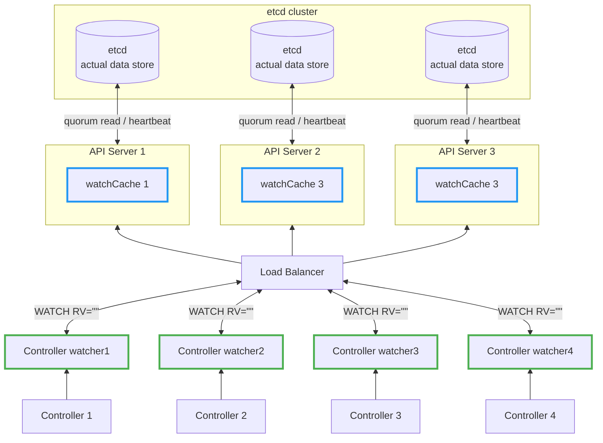

## Why KEP-3157
In large clusters, the LIST+WATCH patterns would cause 2 problems:
1. **Memory Explosion**: Full LIST requests load all resources into memory at once. With thousands of resources, this causes gigabytes of memory consumption per request, risking API server crashes.

2. **Stale Reads**: Traditional LIST uses RV="0", which reads from watchCache without consistency guarantees, potentially serving stale data.

KEP 3157 addresses these issues by introducing a streaming-based approach that:
- Ensures controllers receive consitent, up-to-date data by RV="", avoid reading **stale data**
- Replace memory-intensive LIST+WATCH pattern with single streaming WATCH request


## HA with Stacked etcd topology
KEP-3157 focuses on:

- Memory Efficiency in watchCache
- **Consistency Guarantee** between watchCache across the cluster
- Prevent controller watcher read the stale data.



## ResourceVersion Semantics


| Semantics | `RV=""` | `RV="0"` |
|------|---------|----------|
| Source | etcd quorum read | Watch Cache |
| Latency | High | Low |
| Data Fresh | latest | Can be stale |
| Consistency | Strong Consistency | Eventual concistwency |
| Use case | Initializartion the wattchCache | Monitoring |

### `RV=""`
- FLow: etcd **Quorum Read**
- Why CP
  - Performs quorum read from etcd to ensure strong consistency, but may block during network partitions.


### `RV="0"`
- Flow: Read **Watch Cache**, if empty fall back to etcd **Quorum Read**
- Why AP
  - Serves from apiserver's watch cache for immediate response and high availability, tolerating eventual consistency.

## Consistency Guarantee Mechanism
RV in the watchCache could be different from the one in controller watch cache (CW), due to the wirting speed of each api-server.

If Controller 2 call the RV = "0", it will get the data with RV = 95, which is the root cause of [stale read](https://github.com/kubernetes/kubernetes/issues/59848).
```bash
etcd cluster
    ↓
    ├─→ API Server 1 → watchCache 1 (RV=100) → Controller 1
    ├─→ API Server 2 → watchCache 2 (RV=95)  → Controller 2
    └─→ API Server 3 → watchCache 3 (RV=100) → Controller 3
```

### KEP-3157 Solution

To address memory exhaustion issues, KEP-3157 introduces a new approach: when a controller establishes a watch connection, it can specify `RV=""` with `sendInitialEvents=true` to ensure a quorum read from etcd for consistent data.

This design introduces an interesting challenge: the watchCache's RV may differ from the target RV obtained from etcd. To handle this discrepancy, the Beta version implements sophisticated strategies:

- **Pre-check RV difference**: If `(targetRV - watchCache.currentRV) >= 1000` (the buffer size), synchronization might timeout
- **Graceful handling**: If the bookmark event exists in the buffer, perform a soft-close; otherwise, execute a hard-close
- The goal is to avoid scenarios where the gap is too large to complete synchronization

If the gap is excessive and timeout occurs, the cacheQatcher reconnects to a different API server. Since each connection performs a quorum read, this ensures data freshness - the secret behind the Consistency Guarantee Mechanism.

**Synchronization completion** is signaled by a [bookmark](#bookmark-note) event.

For detailed implementation, see the [KEP-3157](https://github.com/kubernetes/enhancements/blob/master/keps/sig-api-machinery/3157-watch-list/README.md) document.

### Why Streaming Alleviates Memory Pressure?
Watch-List uses a streaming approach that sends objects one-by-one instead of preparing the entire response in memory. Combined with `RV=""` initialization (quorum read), it ensures:

1. **Consistent baseline**: Each controller watchCatch establishes a consistency checkpoint via quorum read
2. **Memory efficiency**: Only one copy in watchCache, streamed to all watchers
3. **No time-travel**: Even when switching API servers, the RV-based mechanism prevents reading older data than previously observed

#### Traditional LIST approach
Memory per request = `O(object_count × object_size × 5)`

#### Watch-List approach
Memory = `O(1 shared cache + small per-watcher buffers)`

## The Hidden truth
### Env setup
Through extensive testing across Kubernetes versions, I discovered that:

- Kubernetes 1.32.x: WatchList feature gate is enabled by default, but memory usage remains HIGH (~20GB)
- Kubernetes 1.33.x: WatchList disabled by default, but introduces `StreamingCollectionEncoding` , achieving the promised LOW memory (~2GB)
  - a **90% reduction** - this is the real game-changer, so I pick this one as experment environment
- Kubernetes 1.34.x: WatchList is stable which is not allowed to mutated to false

### Test Workload
- Test Resources: a custome CR iwht 1MB * 100
- Watcher: 20
- Expected memory usage:
  - O(watchers*page-size*object-size*5) to O(watchers*constant)
  - watch list off, O(watchers*page-size*object-size*5): 20 * 1MB * 100 * 5 = 10GB
  - watch list on, O(watchers*constant), constant around 2 MB: 20 * 2MB = 400MB

### Result
- 13GB -> 1G, **over 90%** memory usage reduce!

Result from watch list off, apiserver memory peak ─ **700MB -> 13GB**

Result from watch list on, apiserver memory peak ─ **700MB -> 1GB**


### Informer-Driven API Server Load Simulation

To accurately simulate server pressure, here is how I [implement](https://github.com/pohanhuang/kep-sandbox/tree/main/keps/3157-watchlist)
- Use pure informer to simulate the controller
- Drops updates immediately via SetTransform(return nil) to **eliminate** client-side memory pressure
- Use Prometheus to collect the metrics


## Key Takeaways
1. Watch-List uses `RV=""` with `sendInitialEvents=true` initialization to prevent stale reads
2. Even if a controller's watch connection times out during sync, the next connection will read up-to-date data (unless all API servers fail)
3. For high-QPS, freshness-tolerant reads, `RV="0"` serves from the watch cache with low latency
4. KEP-3157 introduces `resourceVersionMatch=NotOlderThan` to prevent reading data "older than what you already saw" when the load balancer switches between API servers
5. ⚠️ Implementation Evolution: KEP-3157 alone is NOT sufficient for memory optimization. It requires `StreamingCollectionEncoding` for true memory savings (introduced in Kubernetes 1.33)
6. To eliminate **stale reads** and **reduce API server memory pressure**, upgrade to Kubernetes v1.34 where both KEP-3157 and streaming encoding are stable

---
## Reference
- [KEP-3157](https://github.com/kubernetes/enhancements/blob/master/keps/sig-api-machinery/3157-watch-list/README.md)
- [Informer-Driven API Server Load Simulation Implementation Repo](https://github.com/pohanhuang/kep-sandbox/tree/main/keps/3157-watchlist)

### Note
- <a id="bookmark-note"></a> **Bookmark Event** — a Kubernetes watch event that notifies the client of the query object's resource version.